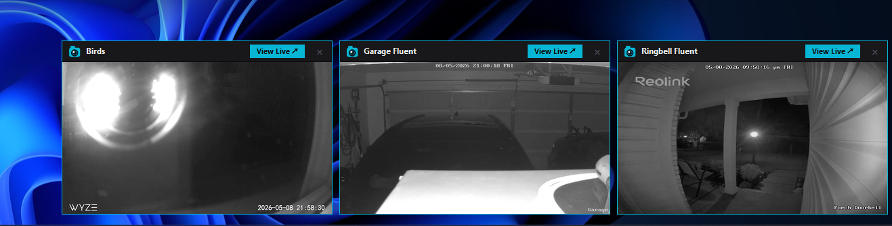
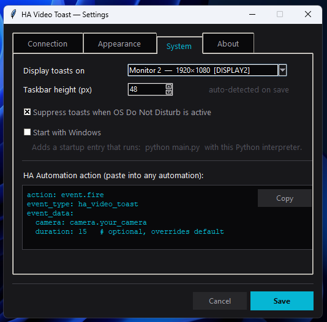

# HA Video Toast

Desktop toast notifications with live camera feeds from [Home Assistant](https://www.home-assistant.io/), triggered by HA automations. No RTSP configuration required — the app connects directly to HA and streams video through its built-in camera proxy.

  [](https://paypal.me/vessosa)

---

<p align="center">
  
  &nbsp;&nbsp;
  
</p>

---

## Table of Contents

- [Features](#features)
- [How It Works](#how-it-works)
- [Requirements](#requirements)
- [Installation](#installation)
- [Running](#running)
- [Home Assistant Setup](#home-assistant-setup)
- [Configuration](#configuration)
- [Building a Standalone Executable](#building-a-standalone-executable-windows)
- [Starting with Windows](#starting-with-windows)
- [Contributing](#contributing)
- [License](#license)
- [Author](#author)
- [Support](#support)

---

## Features

- **Live MJPEG video** in each toast — no extra streaming setup
- **Always-on-top** overlay, auto-dismisses with countdown bar
- **Multi-camera** — multiple simultaneous toasts, one per camera, stack left from chosen corner
- **Slide animation** — remaining toasts slide smoothly when one closes
- **Fade in / fade out** on appear and dismiss
- **Multi-monitor** — pick which monitor to display toasts on
- **Corner selector** — top-left, top-right, bottom-left, or bottom-right
- **OS Do Not Disturb** — suppresses toasts when Windows Focus Assist is active
- **GUI settings** — no YAML, configure everything through a tabbed settings window
- **View Live** — click to open the camera stream directly in your browser
- **Start with Windows** — one checkbox registers a startup entry

---

## How It Works

```
Home Assistant automation
        │
        ▼  event.fire  ha_video_toast  {camera: camera.doorbell}
HA WebSocket API  (ws://ha-url:8123/api/websocket)
        │
        ▼
ha_client.py  ──►  toast_manager.py  ──►  toast_window.py
  WS listener       slot layout             MJPEG stream
                    slide animation         fade in/out
                    DND gate                countdown bar
                                            "View Live" button
```

The app connects to HA via WebSocket and subscribes to a custom event type (`ha_video_toast`). When an automation fires that event, the app opens a toast window and streams the camera feed from HA's built-in MJPEG proxy (`/api/camera_proxy_stream/<entity>`). No RTSP URL is ever needed by the user.

---

## Requirements

- Python 3.11+
- Home Assistant (any recent version)
- A camera entity in HA (Reolink, Frigate, generic RTSP, etc.)

---

## Installation

```bash
git clone https://github.com/vessosa/ha-video-toast
cd ha-video-toast

python -m venv venv
venv\Scripts\activate        # Windows
# source venv/bin/activate   # Linux / macOS

pip install -r requirements.txt
```

### Dependencies

| Package | Purpose |
|---------|---------|
| `websockets` | Home Assistant WebSocket connection |
| `requests` | MJPEG stream and HA REST API calls |
| `Pillow` | Image rendering, icon generation |
| `pystray` | System tray icon |
| `screeninfo` | Multi-monitor detection (fallback) |

---

## Running

```bash
python main.py
```

The app starts in the system tray. On first run the Settings window opens automatically.

---

## Home Assistant Setup

### 1. Generate a Long-Lived Access Token

In HA → **Profile** → **Security** → **Long-lived access tokens** → Create token.  
Paste it into **Settings → Connection**.

### 2. Create an Automation

Add this action to any automation (doorbell press, motion detected, Frigate event, etc.):

```yaml
action: event.fire
event_type: ha_video_toast
event_data:
  camera: camera.your_camera      # HA camera entity ID
  duration: 15                    # optional — overrides default duration
  width: 480                      # optional — overrides default toast width
  height: 295                     # optional — overrides default toast height
```

All fields except `camera` are optional. When omitted, configured defaults are used. This lets different cameras use different sizes — useful for cameras with different native aspect ratios.

**Example — Frigate person detection:**

```yaml
alias: Doorbell person detected
trigger:
  - platform: state
    entity_id: binary_sensor.doorbell_person
    to: "on"
action:
  - action: event.fire
    event_type: ha_video_toast
    event_data:
      camera: camera.doorbell
      duration: 20
      width: 480     # optional — set for cameras with non-standard aspect ratio
      height: 295    # optional
```

---

## Configuration

Right-click the tray icon → **Settings**.

| Tab | Options |
|-----|---------|
| Connection | HA URL, access token, test connection |
| Appearance | Toast size, duration, gap, max toasts, corner position |
| System | Monitor selector, taskbar height, Do Not Disturb, Start with Windows |
| About | App info, links, license |

> All settings are saved automatically to `~/.ha-video-toast/config.json`  
> (Windows: `%USERPROFILE%\.ha-video-toast\config.json`)

---

## Building a Standalone Executable (Windows)

Use [PyInstaller](https://pyinstaller.org/) to produce a single `.exe` that requires no Python installation:

```bash
pip install pyinstaller

pyinstaller --onefile --windowed --name ha-video-toast main.py
```

| Flag | Purpose |
|------|---------|
| `--onefile` | Bundle everything into a single `.exe` |
| `--windowed` | No console window (background app) |
| `--name` | Output filename |

The executable will be at `dist\ha-video-toast.exe`.

### Optional: embed an icon in the exe

Export the app icon as a `.ico` file, then:

```bash
pyinstaller --onefile --windowed --name ha-video-toast --icon icon.ico main.py
```

---

## Starting with Windows

**Option A — Settings window (recommended):**  
Settings → System → check **Start with Windows**.  
This writes a `.bat` file to your Windows Startup folder that launches the app using the current Python interpreter (venv-aware).

**Option B — Compiled exe:**  
Copy `dist\ha-video-toast.exe` to:
```
%APPDATA%\Microsoft\Windows\Start Menu\Programs\Startup\
```

---

## Contributing

Contributions are welcome! Feel free to open issues or submit pull requests.

- Bug reports and feature requests → [Issues](https://github.com/vessosa/ha-video-toast/issues)
- Code contributions → fork the repo and open a pull request

---

## License

MIT — see [LICENSE](LICENSE).

## Author

**Luiz Vessosa**  
GitHub: [github.com/vessosa/ha-video-toast](https://github.com/vessosa/ha-video-toast)

Feel free to open an issue or discussion if you need help!

## Support

If this project saved you time, a coffee is always appreciated:  
[](https://paypal.me/vessosa)
